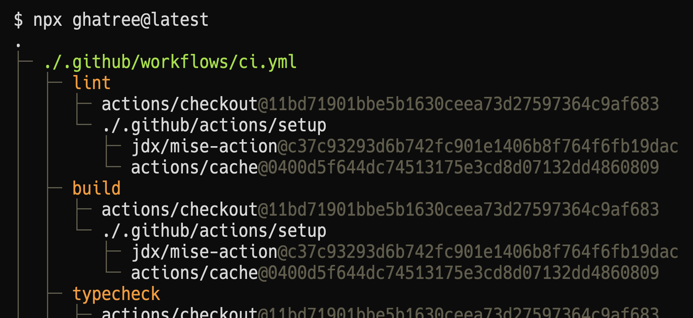

[](https://www.npmjs.com/package/ghatree)
[](https://github.com/koki-develop/ghatree/actions/workflows/release-please.yml)
[](./LICENSE)

# ghatree



Visualize GitHub Actions workflow dependencies as a tree structure.

## Usage

You can run it with `npx`.

```bash
$ npx ghatree@latest
```

`ghatree` internally uses the GitHub REST API to retrieve GitHub Actions information.
You can set the token for the GitHub REST API using the `GITHUB_TOKEN` environment variable.

```bash
$ GITHUB_TOKEN=<YOUR_TOKEN> npx ghatree@latest
```

By default, `ghatree` outputs the GitHub Actions workflow dependencies for the repository in the current directory.
To specify a remote repository, use the `--repo` flag.

```bash
$ npx ghatree@latest --repo koki-develop/ghatree
```

## License

[MIT](./LICENSE)
